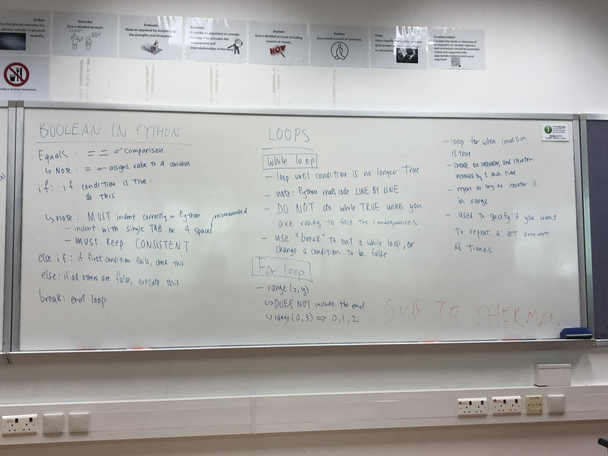

### What did I do?
I was a **teaching assistant** for the 2020 Shuyuan CS Bootcamp, taught by Dr. Angelo Leung. The course covered basic computer science principles, from basic datatypes to algorithms, and some useful Python packages, such as Matplotlib. I was in charge of helping to **create curriculum, teach this curriculum, maintain daily documentation, provide sample solutions, and help the kids out with any issues they had.** The course successfully **increased students' confidence in computer science**, with it going from an average of 2.7/5 before the course to 3.3/5.

### What did I learn?
#### Patience
Middle school aged children are also ... very bratty if you will. Many of the children lost patience when dealing with code that they didn't understand, and I had to be very patient dealing with them.
### Course Materials

Daily documentation of the course can be found in the blog I created for this course, which you can access below.

[─=≡Σ((( つ*̀ω*́)つ CS Bootcamp 2020](https://2020csbootcamp.bearblog.dev/)

You can also find the sample solutions in the GitHub repository I created for this course.

[wangyhdaisy/CS-Bootcamp](https://github.com/wangyhdaisy/CS-Bootcamp)
