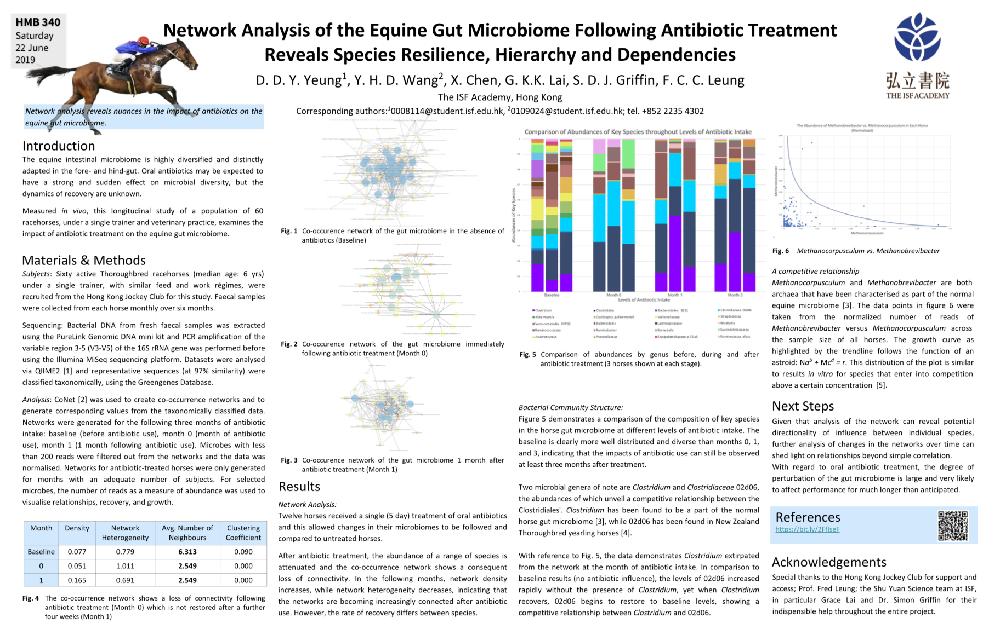
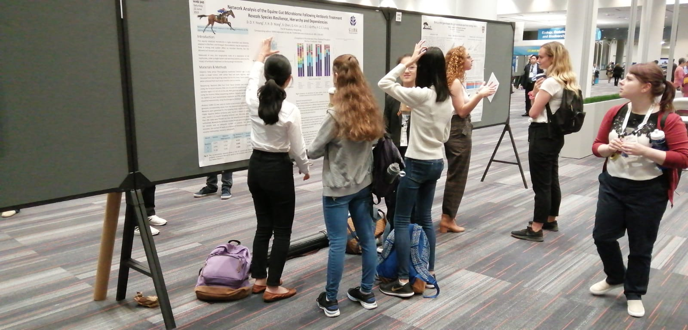
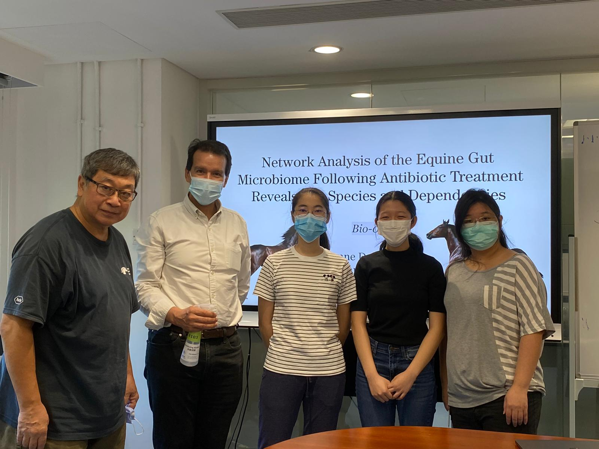

### Awards
- “Best Newcomer” in the 2020 Hong Kong Student Science Project Competition (1/89)
- Second in Asia in the Shing-Tung Yau High School Science Awards Biology Category (2/49+)

### Publications
#### American Society for Microbiology 2019 Microbe Conference

Together with Dionne, I produced an abstract and a poster that was accepted for presentation at the American Microbiology Society 2019 Microbe conference.

#### Bauhinia VI Issue 2
Together with Dionne, I produced a paper that was published in the Bauhinia Volume VI Issue 2 (ISSN 2409-4064). A link to the paper can be found [here](https://drive.google.com/file/d/1YEI62HOU-2h43sOIQR8cWqc3iMZaBSBt/view).

### The Team Behind it All

Special thanks to the incredible Dr. Simon Griffin, Professor Fred Leung, and Ms. Grace Lai from the ISF Academy Shuyuan Microbiology Lab for their incredible support and guidance throughout this journey. Also incredibly thankful towards my amazing partner Dionne Daiyin Yeung - without her, this project would not exist as it does today.
