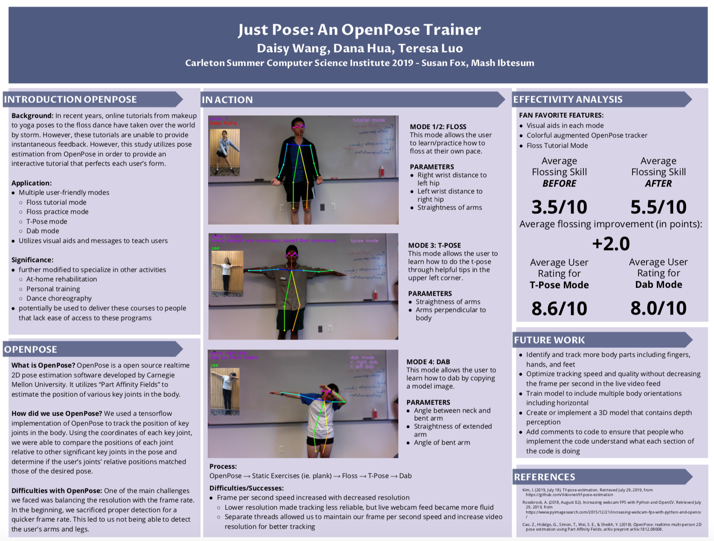

### What is this?

This was a project I created as part of a team in the Carleton Summer Computer Science Institute in 2019 in two weeks. The software acts like a **virtual personal trainer**, and confirms if you are doing the correct movements for a specified move.

We were able to create **tutorials for viral dance moves**, such as flossing, t-posing, and the dab. The user would try and mimic the image shown on screen, while live feedback would be given by the software. For dynamic movement, the user would be able to change the speed at which they performed the move through controls on the keyboard.

Although this software is a bit of a silly proof of concept, it has immense potential through bridging the gap between fully interactive in person instruction and static video based instruction. Future applications include virtual personal training for people who want feedback on their movements but are unable to pursue in person training, or fields such as virtual physical therapy.

### How does it work?

The entire program was built upon the open source pose-estimator **OpenPose**. By taking the location of the joints identified by OpenPose, we were able to determine the angles between a user's limbs, thus identify if they were performing a pose correctly.

### Demo

<iframe width="560" height="315" src="https://www.youtube.com/embed/q7B6o-09Fmo" title="YouTube video player" frameborder="0" allow="accelerometer; autoplay; clipboard-write; encrypted-media; gyroscope; picture-in-picture" allowfullscreen></iframe>

### Poster

A poster that we created as part of our final poster presentation in the Carleton Summer Computer Science Institute.
