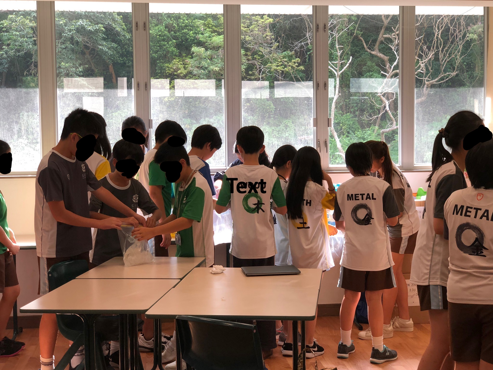
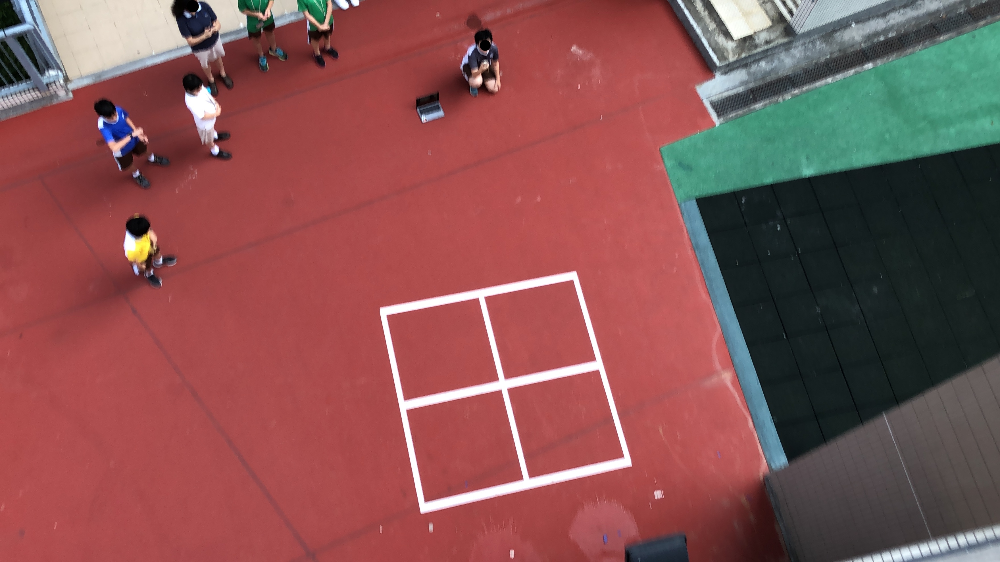
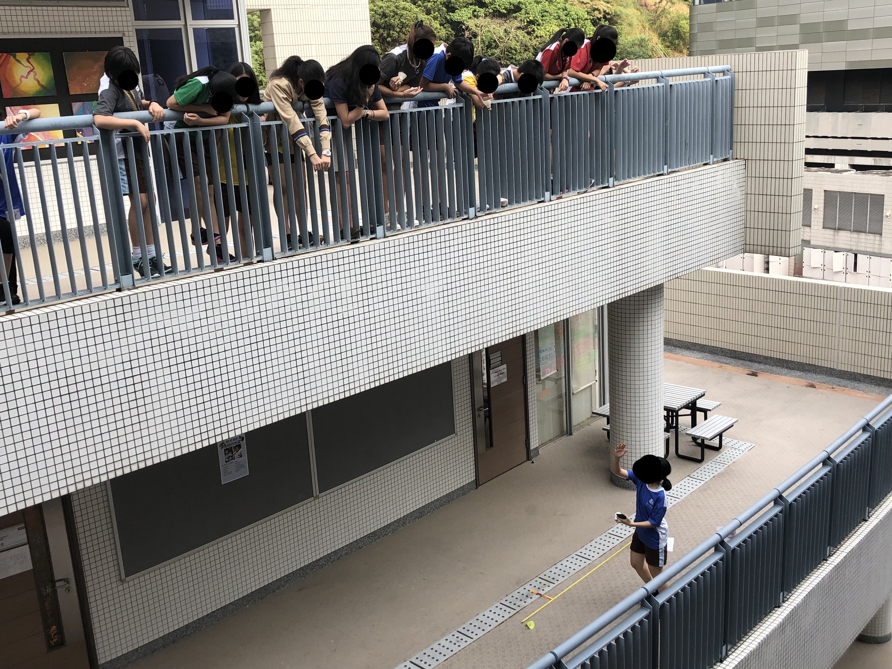
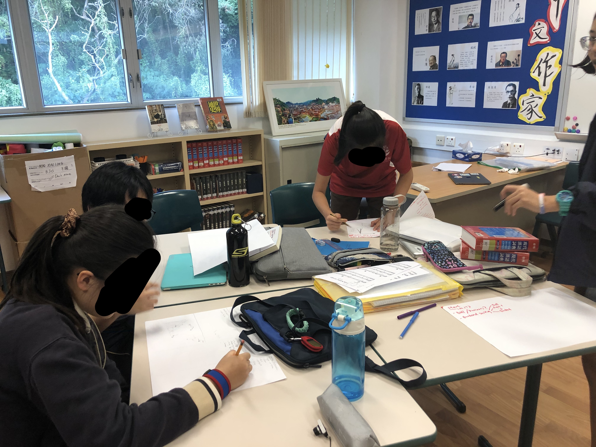

### What is this?
Physics Club ran **weekly one hour sessions** after school, where I, along with a few other grade 11 physics students, taught middle schoolers about physics. Our approach was one centred upon **hands on learning** and experiments, but also with a solid grounding in theoretical knowledge. Through our weekly sessions, we hoped to **build the interest of middle schoolers in physics** as physics is less popular in my school, as well as **empower** them to use physics to create a positive impact on the world.

As the founder, I **negotiated** with the school as well as teachers to balance interests, and establish this as part of our schools **official Gifted and Talented offering for middle schoolers**. I **created our own original curriculum, as well as planned and taught the lessons**. Our club has maintained high interest within the middle schoolers, as well as high interest from parents.

### Sample activities we've run

Note: Face have been hidden in order to protect the privacy of the children.

#### Ice cream making - thermal physics and state changes

#### Water balloon drop - kinematics

### Hit the moving target - kinematics

### Rube Goldberg machines - final project

