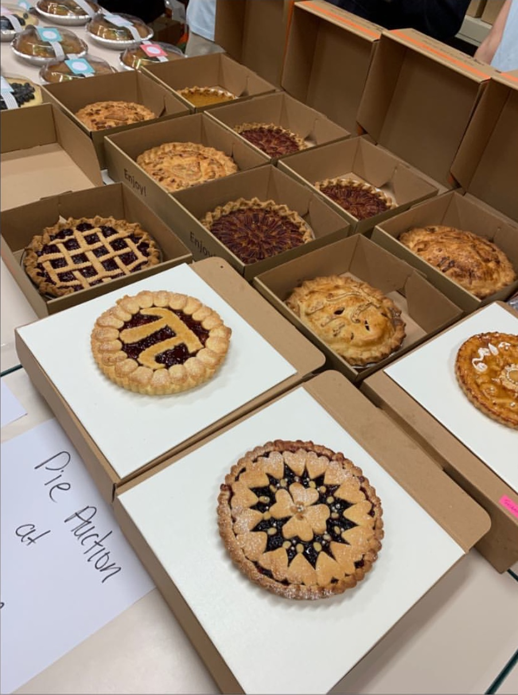
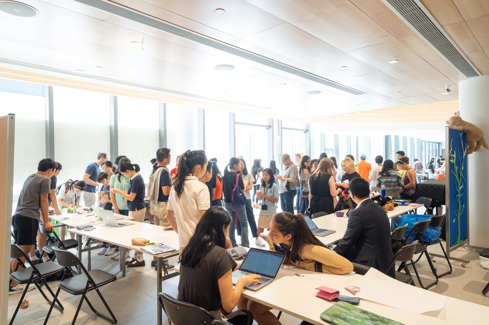

### What Did I Do?
I am the president of the ISF Room to Read chapter, where we plan various fundraising and awareness raising events to benefit Room to Read. I manage a group of roughly 10 volunteers. Under my leadership, I have managed to **increase annual profit by +270% in two years** by overhauling our fundraising strategy - instead of focusing on student donations, we now focus more on parent donations. I am in charge of decided the overall goals and direction of our chapter, as well as being the **first point of contact for communications** between the PTA, teachers, and students for any information regarding our chapter.

### Past Events
#### Pi Night

During the Pi Night event at our school, we coordinated PTA and student pie donations to host a hugely successful pie sale that raised over 26000 HKD for Room to Read.

#### Bookmark Making

During our school's Service Day fair (pictured above) as well as our school's Christmas fair, we hosted a booth where people could donate to create bookmarks in order to raise funds and raise awareness for Room to Read. The booth proved popular with middle schoolers, and we were able to raise around 4000 HKD for Room to Read.
