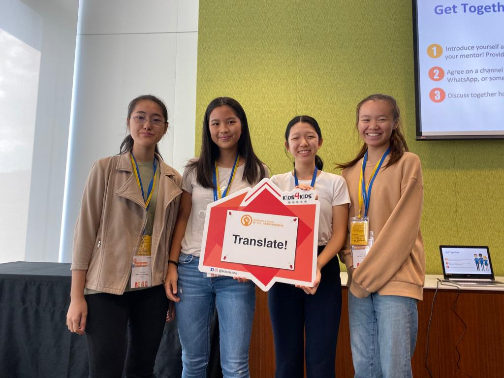

### What is this?
Translate! is an organisation that I founded to **connect volunteer translators with charity organisations**. Translate! utilises a **web-based platform** where charities can post requests for translations, and volunteers can sigh up to accept these translation requests. This project was inspired by the fact that Hong Kong has a vast bilingual population who are capable of serving as translators, and serve as a hugely under-utilised resource.Through this, we hope to increase the spread of a charity's message, as well as free up more time for charities to engage in other tasks.

We were funded from 2019-2020 by Kids4Kids through their Act!on for Change program, through which we received a **3000 HKD grant**.

At the moment, we have partnered with Kids4Kids where we have helped translate **10 children's stories** for their annual publication, the Treasury.

### How does it work?
Translate! was build upon WordPress using the WP Job Manager plugin, and a modified version of the Robojobs theme.  In order to ensure quality, charities and volunteers must be verified before they can fully interact with the website. Charities post a request, and volunteers can browse through the postings to find opportunities of their liking, and respond accordingly.

### The team behind it

I was fortunate enough to be able to collaborate with Clarisse Tsang, Coco Yeung, and Dionne Yeung on this project.

### Where's the website?
Unfortunately, due to all of the co-founders becoming increasingly busy with school, we have decided to end this project. We used to be at [http://translate4good.com](http://translate4good.com).
